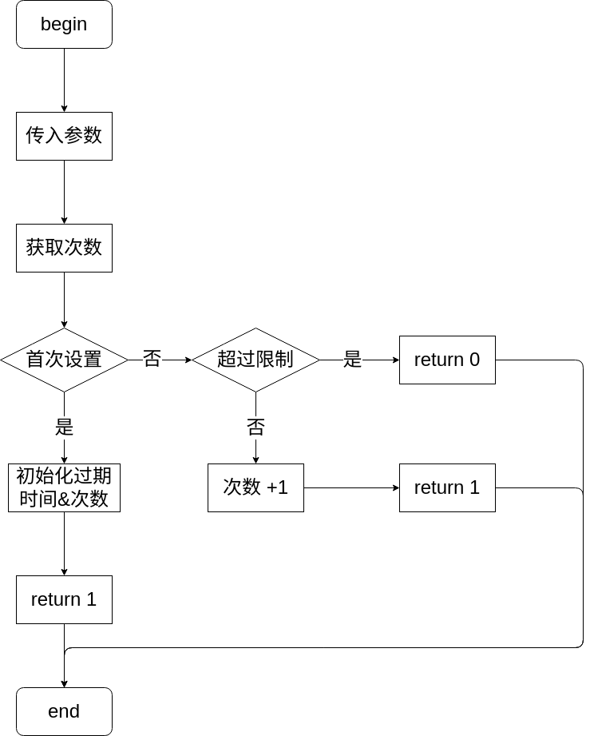
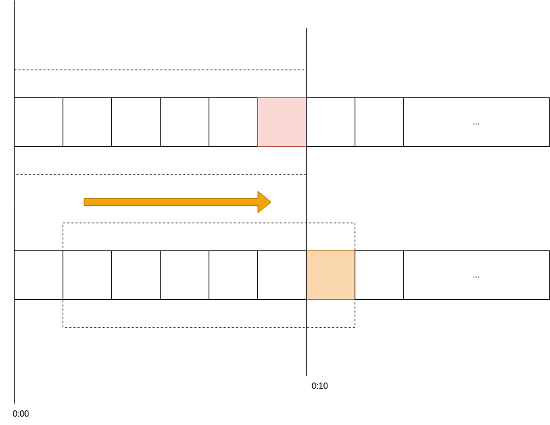

# Redis 中 Lua 脚本的应用和实践

内容可参考: http://redisdoc.com/script/index.html

## redis lua 脚本相关命令

redis 自 2.6.0 加入了 lua 脚本相关的命令， `EVAL`、 `EVALSHA`、 `SCRIPT EXISTS`、 `SCRIPT FLUSH`、 `SCRIPT KILL`、 `SCRIPT LOAD`，自 3.2.0 加入了 lua 脚本的调试功能和命令 `SCRIPT DEBUG`。这里对命令做下简单的介绍。

- `EVAL` 执行一段lua脚本，每次都需要将完整的lua脚本传递给redis服务器。
- `SCRIPT LOAD` 将一段lua脚本缓存到redis中并返回一个tag串，并不会执行。
- `EVALSHA` 执行一个脚本，不过传入参数是 `SCRIPT LOAD` 中返回的tag，节省网络带宽。
- `SCRIPT EXISTS` 判断tag串是否存在服务器中。
- `SCRIPT FLUSH` 清除服务器上的所有缓存的脚本。
- `SCRIPT KILL` 杀死正在运行的脚本。
- `SCRIPT DEBUG` 设置调试模式，可设置同步、异步、关闭，同步会阻塞所有请求。

相较于 EVAL的每次发送脚本主体、浪费带宽，使用 EVALSHA 会更高效。
这里要注意 SCRIPT KILL，杀死正在运行脚本的时候，如果脚本执行过写操作了，这里会杀死失败，因为这违反了 redis lua 脚本的原子性。调试尽量放在测试环境完成之后再发布到生产环境，在生产环境调试千万不要使用同步模式，原因下文会详细讨论。

## Redis 中 lua 脚本的书写和调试

redis lua 脚本是对其现有命令的扩充，单个命令不能完成、需要多个命令，但又要保证原子性的动作可以用脚本来实现。脚本中的逻辑一般比较简单，不要加入太复杂的东西，因为 redis 是单线程的，当脚本执行的时候，其他命令、脚本需要等待直到当前脚本执行完成。因此，对 lua 的语法也不需完全了解，了解基本的使用就足够了，这里对 lua 语法不做过多介绍，会穿插到脚本示例里面。

## 一个秒杀抢购示例

假设有一个秒杀活动，商品库存 100，每个用户 uid 只能抢购一次。设计抢购流程如下：

1. 先通过 uid 判断是否已经抢过，已经抢过返回 0结束。
2. 判断商品剩余库存是否大于0，是的话进入「3」，否的话返回 0结束。
3. 将用户 uid 加入已购用户set中。
4. 物品数量减一，返回成功 1结束。

```lua
-- 一组商品秒杀 每个用户只能抢其中一种商品1个
local goodsSurplus
local flag
-- 判断用户是否已抢过
local buyMembersKey   = tostring(KEYS[1]) -- 已经购买过的用户的Set的名称
local memberUid       = tonumber(ARGV[1]) -- 用户id
local goodsSurplusKey = tostring(KEYS[2]) -- 商品key
local hasBuy = redis.call("sIsMember", buyMembersKey, memberUid)
-- 已经抢购过，返回0
if hasBuy ~= 0 then
    return 0
end
-- 准备抢购
goodsSurplus =  redis.call("GET", goodsSurplusKey)
if goodsSurplus == false then -- 商品key不存在 可能商品已经下架
    return 0
end
-- 库存判断
goodsSurplus = tonumber(goodsSurplus)
if goodsSurplus <= 0 then -- 商品已经没有库存
    return -1
end
flag = redis.call("SADD", buyMembersKey, memberUid)
flag = redis.call("DECR", goodsSurplusKey)
return 1
```

在命令行运行脚本的时候，脚本后面传入的是参数，通过 "," 分隔为两组，前面是键，后面是值，这两组分别写入 `KEYS` 和 `ARGV`。分隔符一定要看清楚了，`逗号前后都有空格`，漏掉空格会让脚本解析传入参数异常。

```sh
root@5bef253efe3e:/data# redis-cli set goods_id_1 5
OK
root@5bef253efe3e:/data# redis-cli --eval buy.lua buyMemberSet goods_id_1 , 1
(integer) 1
root@5bef253efe3e:/data# redis-cli --eval buy.lua buyMemberSet goods_id_1 , 1
(integer) 0
root@5bef253efe3e:/data# redis-cli --eval buy.lua buyMemberSet goods_id_1 , 2
(integer) 1
root@5bef253efe3e:/data# redis-cli --eval buy.lua buyMemberSet goods_id_1 , 3
(integer) 1
root@5bef253efe3e:/data# redis-cli --eval buy.lua buyMemberSet goods_id_1 , 4
(integer) 1
root@5bef253efe3e:/data# redis-cli --eval buy.lua buyMemberSet goods_id_1 , 4
(integer) 0
root@5bef253efe3e:/data# redis-cli --eval buy.lua buyMemberSet goods_id_1 , 5
(integer) 1
root@5bef253efe3e:/data# redis-cli --eval buy.lua buyMemberSet goods_id_1 , 6
(integer) -1
```

## debug 调试

1. 如何进入调试模式
执行 redis-cli --ldb--eval /path/to/buy.lua hadBuyUids goodsSurplus,5824742984，进入调试模式，比之前执行的时候多了参数 --ldb，这个参数是开启 lua dubegger 的意思，这个模式下 redis 会 fork 一个进程进入隔离环境，不会影响 redis 正常提供服务，但调试期间，原始 redis 执行命令、脚本的结果也不会体现到 fork 之后的隔离环境之中。因此呢，还有另外一种调试模式 --ldb-sync-mode，也就是前面提到的同步模式，这个模式下，会阻塞 redis 上所有的命令、脚本，直到脚本退出，完全模拟了正式环境使用时候的情况，使用的时候务必注意这点。

2. 帮助信息
> [h]elp
调试模式下，输入 h或者 help展示调试模式下的全部可用指令。

3. 流程相关
> [s]tep 、 [n]ext 、 [c]continue

4. 打印相关
> [p]rint 、 [p]rint

```
# redis-cli --ldb --eval buy.lua buyMemberSet goods_id_1 , 6
Lua debugging session started, please use:
quit    -- End the session.
restart -- Restart the script in debug mode again.
help    -- Show Lua script debugging commands.

* Stopped at 5, stop reason = step over
-> 5   local buyMembersKey   = tostring(KEYS[1]) -- 已经购买过的用户的Set的名称
lua debugger> s
* Stopped at 6, stop reason = step over
-> 6   local memberUid       = tonumber(ARGV[1]) -- 用户id
lua debugger> s
* Stopped at 7, stop reason = step over
-> 7   local goodsSurplusKey = tostring(KEYS[2]) -- 商品key
lua debugger> s
* Stopped at 8, stop reason = step over
-> 8   local hasBuy = redis.call("sIsMember", buyMembersKey, memberUid)
lua debugger> s
<redis>
<reply> 0
* Stopped at 10, stop reason = step over
-> 10  if hasBuy ~= 0 then
lua debugger> s
* Stopped at 14, stop reason = step over
-> 14  goodsSurplus =  redis.call("GET", goodsSurplusKey)
lua debugger> p
<value> goodsSurplus = nil
<value> flag = nil
<value> buyMembersKey = "buyMemberSet"
<value> memberUid = 6
<value> goodsSurplusKey = "goods_id_1"
<value> hasBuy = 0
lua debugger> s
<redis>
<reply> "0"
* Stopped at 15, stop reason = step over
-> 15  if goodsSurplus == false then -- 商品key不存在 可能商品已经下架
lua debugger> n
* Stopped at 19, stop reason = step over
-> 19  goodsSurplus = tonumber(goodsSurplus)
lua debugger> n
* Stopped at 20, stop reason = step over
-> 20  if goodsSurplus <= 0 then -- 商品已经没有库存
lua debugger> n
* Stopped at 21, stop reason = step over
-> 21      return -1
lua debugger> n

(integer) -1

(Lua debugging session ended -- dataset changes rolled back)

127.0.0.1:6379>
```

5. 断点相关
> [b]reak 、 [b]reak、 [b]reak -、 [b]reak 0

展示断点、像指定行添加断点、删除指定行的断点、删除所有断点。

6. 其他命令
> [r]edis 在调试其中执行 redis 命令
> [m]axlen [len] 设置展示内容的最大长度，0表示不限制
> [a]bort 退出调试模式，同步模式下(设置了参数 --ldb-sync-mode)修改会保留。
> [e]eval\<code\> 执行一行 lua 代码。
> [t]race 展示执行栈。

## 请求限流
至此，算是对 redis lua 脚本有了基本的认识，基本语法、调试也做了了解，接下来就实现一个请求限流器。流程和代码如下：



```lua
--[[
    传入参数：
    业务标识
    ip
    限制时间
    限制时间内的访问次数
]]--
local busIdentify   = tostring(KEYS[1]) -- 业务标识
local ip            = tostring(KEYS[2]) -- ip
local expireSeconds = tonumber(ARGV[1]) -- 限制时间 单位(秒)
local limitTimes    = tonumber(ARGV[2]) -- 限制时间内的访问次数
local identify  = busIdentify .. "_" .. ip
local times     = redis.call("GET", identify)
--[[
    获取已经记录的时间
    获取到继续判断是否超过限制
    超过限制返回0
    否则加1，返回1
]]--
if times ~= false then
    times = tonumber(times)
    if times >= limitTimes then
        return 0
    else
        redis.call("INCR", identify)
        return 1
    end
end
-- 不存在的话，设置为1并设置过期时间
local flag = redis.call("SETEX", identify, expireSeconds, 1)
return 1
```

这个请求限流功能还有值得优化的地方，如果连续的两个计数周期，第一个周期的最后请求 3 次，接着马上到第二个周期了，又可以请求了，这个地方如何优化呢，我们接着往下看。

### 请求限流优化
上面的计数器法简单粗暴，但是存在临界点的问题。为了解决这个问题，引入类似滑动窗口的概念，让统计次数的周期是连续的，可以很好的解决临界点的问题，滑动窗口原理如下图所示：



建立一个 redis list 结构，其长度等价于访问次数，每次请求时，判断 list 结构长度是否超过限制次数，未超过的话，直接加到队首返回成功，否则，判断队尾一条数据是否已经超过限制时间，未超过直接返回失败，超过删除队尾元素，将此次请求时间插入队首，返回成功。

```lua
local busIdentify   = tostring(KEYS[1]) -- 业务标识
local ip            = tostring(KEYS[2]) -- ip
local expireSeconds = tonumber(ARGV[1]) -- 限制时间 单位(秒)
local limitTimes    = tonumber(ARGV[2]) -- 限制时间内的访问次数
-- 传入额外参数，请求时间戳
local timestamp     = tonumber(ARGV[3]) -- 调用时间戳
local lastTimestamp
local identify  = busIdentify .. "_" .. ip
local times     = redis.call("LLEN", identify)
if times < limitTimes then
    redis.call("RPUSH", identify, timestamp)
    return 1
end
lastTimestamp = redis.call("LRANGE", identify, 0, 0)
lastTimestamp = tonumber(lastTimestamp[1])
if lastTimestamp + expireSeconds >= timestamp then
    return 0
end
redis.call("LPOP", identify)
redis.call("RPUSH", identify, timestamp)
return 1
```

时间戳参数: redis 默认情况复制 lua 脚本到备机和持久化中，如果脚本是一个非纯函数（pure function），备库中执行的时候或者宕机恢复的时候可能产生不一致的情况，这里可以类比 mysql 中基于 SQL 语句的复制模式。redis 在 3.2 版本中加入了 `redis.replicate_commands` 函数来解决这个问题，在脚本第一行执行这个函数，redis 会将修改数据的命令收集起来，然后用  `MULTI/EXEC` 包裹起来，这种方式称为script effects replication，这个类似于 mysql 中的基于行的复制模式，将非纯函数的值计算出来，用来持久化和主从复制。我们这里将变动参数提到调用方这里，调用者传入时间戳来解决这个问题。

## 集群环境中 lua 处理

redis 集群中，会将键分配的不同的槽位上，然后分配到对应的机器上，当操作的键为一个的时候，自然没问题，但如果操作的键为多个的时候，集群如何知道这个操作落到那个机器呢？比如简单的 `mget` 命令， `mget test1 test2 test3` ，还有我们上面执行脚本时候传入多个参数，带着这个问题我们继续。

首先用 docker 启动一个 redis 集群， `docker pull grokzen/redis-cluster` ，拉取这个镜像，然后执行 `docker run -p 7000:7000 -p 7001:7001 -p 7002:7002 -p 7003:7003 -p 7004:7004 -p 7005:7005 --name redis-cluster-script -e "IP=0.0.0.0" grokzen/redis-cluster` 启动这个容器，这个容器启动了一个 redis 集群，3 主 3 从。

我们从任意一个节点进入集群，比如 redis-cli-c-p7003，进入后执行 cluster nodes可以看到集群的信息，我们链接的是从库，执行 setlua fun，有同学可能会问了，从库也可以执行写吗，没问题的，集群会计算出 lua 这个键属于哪个槽位，然后定向到对应的主库。

执行 mset lua fascinating redis powerful，可以看到集群反回了错误信息，告诉我们本次请求的键没有落到同一个槽位上：

```
(error) CROSSSLOT Keys in request don't hash to the same slot
```

同样，还是上面的 lua 脚本，我们加上集群端口号，执行 `redis-cli -p 7000 --eval /tmp/limit_fun.lua limit_vgroup 192.168.1.19 , 1031548660999` ，一样返回上面的错误。

针对这个问题，redis官方为我们提供了 `hash tag` 这个方法来解决，什么意思呢，我们取键中的一段来计算 hash，计算落入那个槽中，这样同一个功能不同的 key 就可以落入同一个槽位了，hash tag 是通过 `{}` 这对括号括起来的字符串，比如上面的，我们改为 `mset lua{yes} fascinating redis{yes} powerful` ，就可以执行成功了，我这里 mset 这个操作落到了 7002 端口的机器。

同理，我们对传入脚本的键名做 `hash tag` 处理就可以了，这里要注意不仅传入键名要有相同的 hash tag，里面实际操作的 key 也要有相同的 hash tag，不然会报错 `Lua script attempted to access a nonlocalkeyina cluster node` ，什么意思呢，就拿我们上面的例子来说，执行的时候如下所示，可以看到 ,前面的两个键都加了 hash tag —— yes，这样没问题，因为脚本里面只是用了一个拼接的 key —— `limit_vgroup{yes}_192.168.1.19{yes}` 。

```
redis-cli -c -p 7000 --eval /tmp/limit_fun.lua limit_vgroup{yes} 192.168.1.19{yes} , 10 3 1548660999
```

如果我们在脚本里面加上 `redis.call("GET","yesyes")` （别让这个键跟我们拼接的键落在一个solt），可以看到就报了上面的错误，所以在执行脚本的时候，只要传入参数键、脚本里面执行 redis 命令时候的键有相同的 hash tag 即可。

另外，这里有个 hash tag 规则：

> 键中包含 {字符；建中包含 {字符，并在 {字符右边；并且 {, }之间有至少一个字符，之间的字符就用来做键的 hash tag。

所以，键 `limit_vgroup{yes}_192.168.1.19{yes}` 的 hash tag 是 `yes` 。 `foo{}{bar}` 键的 hash tag就是它本身。 `foo{{bar}}` 键的 hash tag 是 `{bar` 。
