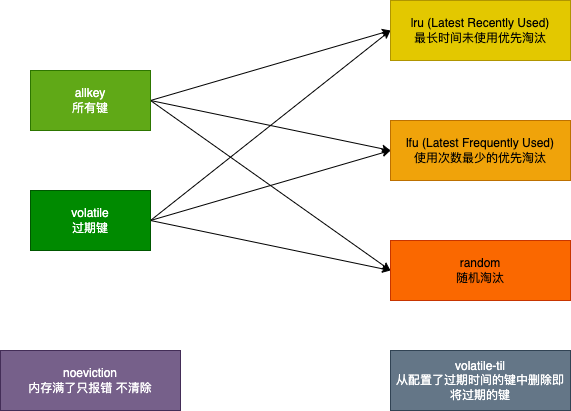

# redis的删除策略与淘汰策略有什么区别

## redis的删除策略和淘汰策略
redis提供了两种删除策略用来清空过期的key：

1. **主动删除/定期删除**：每隔一段时间就扫描一定数据的设置了过期时间的key，并清除其中已过期的keys，大家也注意到了，这里说的是一定数量而不是全部，具体是多少呢？这也是redis亮点之一：基于贪心算法的清除
    1. 判断随机抽取的N个key是否过期
    2. 删除所有已经过期的key
    3. 如果有多于25%的key过期，重复上述两步 为什么不一下子全部删完呢？操作是要消耗性能的，数据量少的情况不会有什么影响，一旦数据量大，修改、删除、新增、查询任何一个操作都会耗费性能，也就是因为如此才产生了各种各样的分布式方案、分布式锁、中间件等等。所以当过期的key比较多时，一下子删很可能导致其他的操作不可用，整个redis就停止工作了。而redis又不知道要删的数据到底有多少，所以采用了25%的标准来判断垃圾到底多不多，多就继续删，少就把当前这点删完就好了

2. **被动删除/惰性删除**：访问key时判断是否过期，过期才删除。也就是说如果这个key过期后一直没有访问它，那么它就一直在不会被删除

基于上述两个删除方案，key过期了都不是马上删除的，无论是定期删除还是访问的时候再删除，都存在了一个时间空隙，如果在这个空隙时间段，内存满了怎么办？
所以引入了淘汰策略，redis提供了8种(2*3+1+1)淘汰策略：
2*3就是 `allkey` , `volatile` 和 `lru` , `random` , `lfu` 的组合总共6种,前2个表示范围，后3个表示策略



1+1就是两个单独的： 
`noeviction` (无受害者) 内存满了返回错误，不会清除任何key 
`volatile-til`: 从配置了过期时间的key中清除马上就要过期的键 
allkey: 所有键，包含过期和未过期的 
volatile: 过期键 
lru: 最近最少使用的优先淘汰，也就是淘汰最长时间未使用的key 
random: 随机淘汰
lfu: 最近最不常用的优先淘汰，也就是淘汰一定时间范围内使用次数最少的。因此可能刚刚用过，但是总共只用了这一次，也会被淘汰。注意和LRU的区别

那么这6种淘汰策略，就不言而喻了，组合起来理解即可

## 有了删除策略，为什么还要有淘汰策略？

这个问题其实上述已经解答了：两个删除方案，key过期了都不是马上删除的，无论是定期删除还是访问的时候再删除，都存在了一个时间空隙，如果在这个空隙时间段，内存满了怎么办？所以引入了淘汰策略 所以两者是互补的，也正是因为如此，很多博文也说有3种**删除策略(1. 主动删除/定时删除 2. 被动删除/惰性删除 3. maxmemory)**，第3种就是maxmemory策略，也就是通过配置maxmemory对应的淘汰策略，来设置内存满了时怎么删除key

```conf
# redis.conf中的配置详情
# 配置最大内存
maxmemory <bytes> 
# 配置淘汰策略
maxmemory-policy noeviction
```