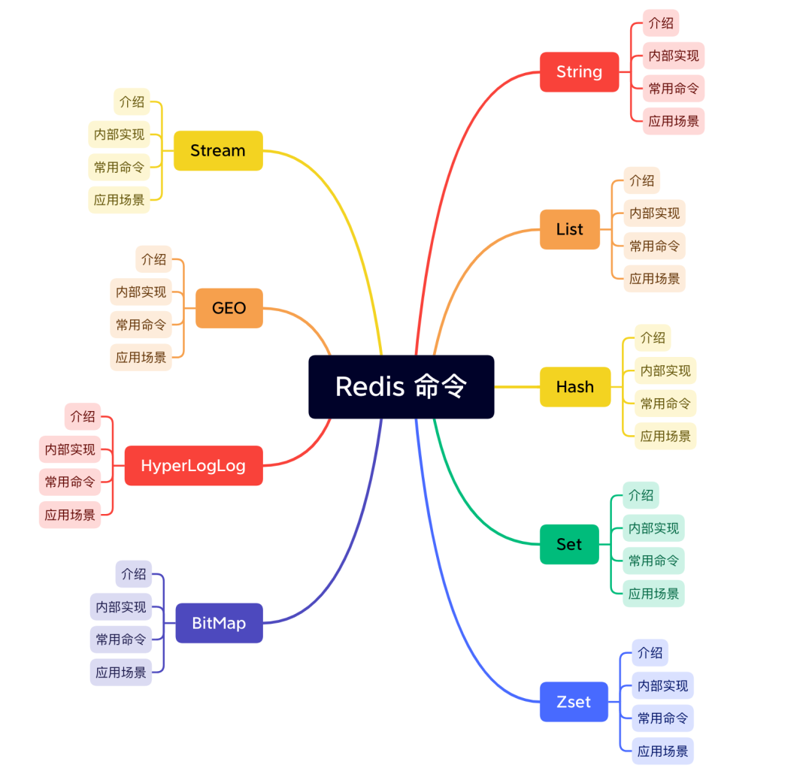
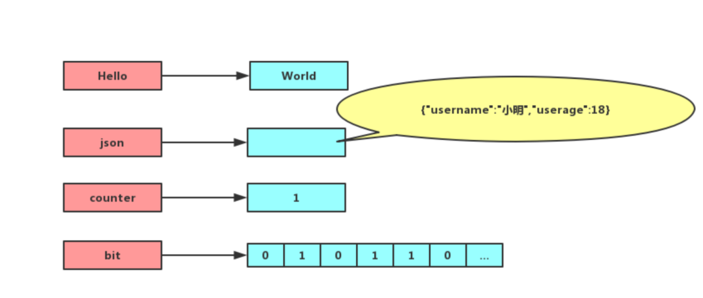
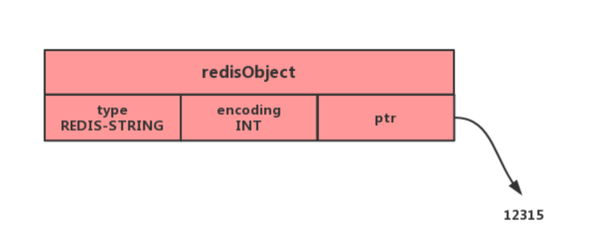
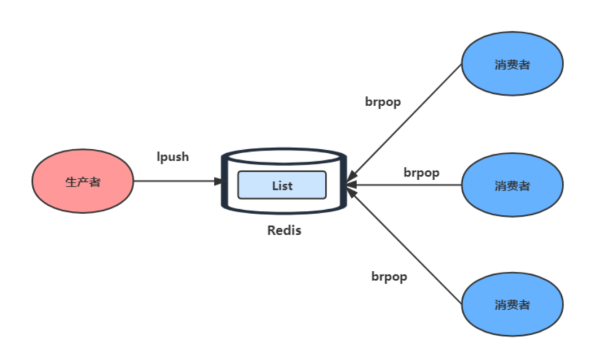
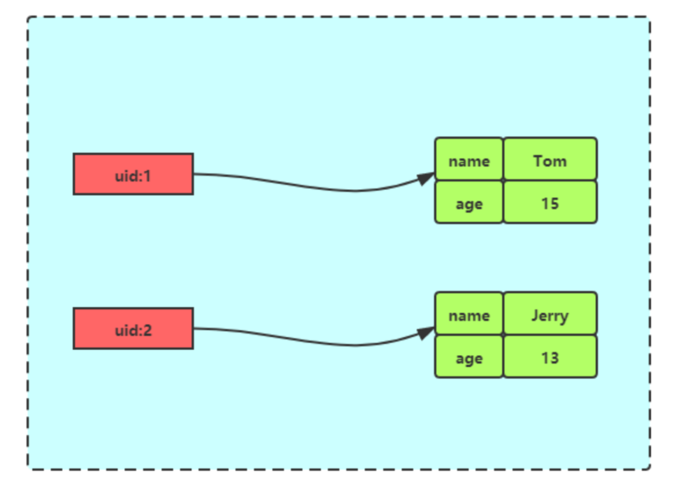
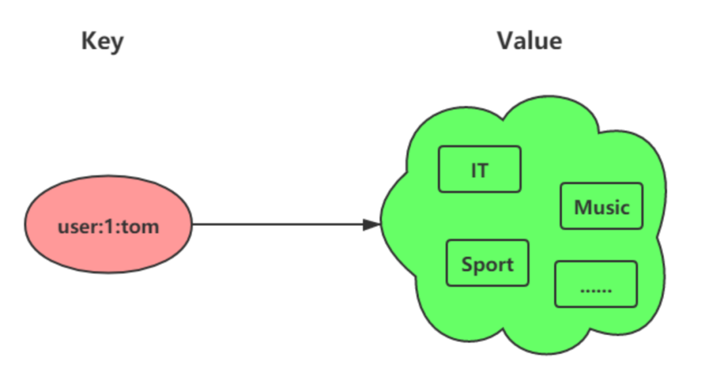
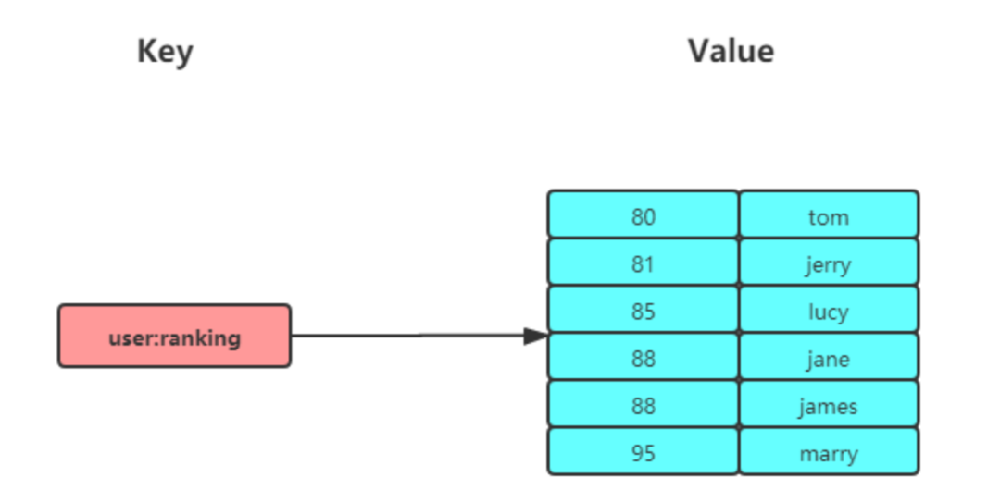

细说 Redis 7.0 的九种数据类型及应用场景
=================================

我们都知道 Redis 提供了丰富的数据类型，常见的有五种：**String（字符串），Hash（哈希），List（列表），Set（集合）、Zset（有序集合）**。

随着 Redis 版本的更新，后面又支持了四种数据类型：**BitMap（2.2 版新增）、HyperLogLog（2.8 版新增）、GEO（3.2 版新增）、Stream（5.0 版新增）**。

每种数据对象都各自的应用场景，你能说出它们各自的应用场景吗？

面试过程中，这个问题也很常被问到，又比如会举例一个应用场景来问你，让你说使用哪种 Redis 数据类型来实现。



String
------

### 介绍

String 是最基本的 key-value 结构，key 是唯一标识，value 是具体的值，value其实不仅是字符串， 也可以是数字（整数或浮点数），value 最多可以容纳的数据长度是 `512M`。


### 内部实现

String 类型的底层的数据结构实现主要是 int 和 SDS（简单动态字符串）。

SDS 和我们认识的 C 字符串不太一样，之所以没有使用 C 语言的字符串表示，因为 SDS 相比于 C 的原生字符串：

*   **SDS  不仅可以保存文本数据，还可以保存二进制数据**。因为 `SDS` 使用 `len` 属性的值而不是空字符来判断字符串是否结束，并且 SDS 的所有 API 都会以处理二进制的方式来处理 SDS 存放在 `buf[]` 数组里的数据。所以 SDS 不光能存放文本数据，而且能保存图片、音频、视频、压缩文件这样的二进制数据。
    
*   \*\*SDS 获取字符串长度的时间复杂度是 O(1)\*\*。因为 C 语言的字符串并不记录自身长度，所以获取长度的复杂度为 O(n)；而 SDS 结构里用 `len` 属性记录了字符串长度，所以复杂度为 `O(1)`。
    
*   **Redis 的 SDS API 是安全的，拼接字符串不会造成缓冲区溢出**。因为 SDS 在拼接字符串之前会检查 SDS 空间是否满足要求，如果空间不够会自动扩容，所以不会导致缓冲区溢出的问题。
    

字符串对象的内部编码（encoding）有 3 种 ：**int、raw和 embstr**。


如果一个字符串对象保存的是整数值，并且这个整数值可以用`long`类型来表示，那么字符串对象会将整数值保存在字符串对象结构的`ptr`属性里面（将`void*`转换成 long），并将字符串对象的编码设置为`int`。


如果字符串对象保存的是一个字符串，并且这个字符申的长度小于等于 32 字节，那么字符串对象将使用一个简单动态字符串（SDS）来保存这个字符串，并将对象的编码设置为`embstr`， `embstr`编码是专门用于保存短字符串的一种优化编码方式：


如果字符串对象保存的是一个字符串，并且这个字符串的长度大于 32 字节，那么字符串对象将使用一个简单动态字符串（SDS）来保存这个字符串，并将对象的编码设置为`raw`：


可以看到`embstr`和`raw`编码都会使用`SDS`来保存值，但不同之处在于`embstr`会通过一次内存分配函数来分配一块连续的内存空间来保存`redisObject`和`SDS`，而`raw`编码会通过调用两次内存分配函数来分别分配两块空间来保存`redisObject`和`SDS`。Redis这样做会有很多好处：

*   `embstr`编码将创建字符串对象所需的内存分配次数从 `raw` 编码的两次降低为一次；
    
*   释放 `embstr`编码的字符串对象同样只需要调用一次内存释放函数；
    
*   因为`embstr`编码的字符串对象的所有数据都保存在一块连续的内存里面可以更好的利用 CPU 缓存提升性能。
    

但是 embstr 也有缺点的：

*   如果字符串的长度增加需要重新分配内存时，整个redisObject和sds都需要重新分配空间，所以**embstr编码的字符串对象实际上是只读的**，redis没有为embstr编码的字符串对象编写任何相应的修改程序。当我们对embstr编码的字符串对象执行任何修改命令（例如append）时，程序会先将对象的编码从embstr转换成raw，然后再执行修改命令。
    

### 常用指令

普通字符串的基本操作：

```
# 设置 key-value 类型的值
> SET name lin
OK
# 根据 key 获得对应的 value
> GET name
"lin"
# 判断某个 key 是否存在
> EXISTS name
(integer) 1
# 返回 key 所储存的字符串值的长度
> STRLEN name
(integer) 3
# 删除某个 key 对应的值
> DEL name
(integer) 1
```

批量设置 :

```
# 批量设置 key-value 类型的值
> MSET key1 value1 key2 value2 
OK
# 批量获取多个 key 对应的 value
> MGET key1 key2 
1) "value1"
2) "value2"
```

计数器（字符串的内容为整数的时候可以使用）：

```
# 设置 key-value 类型的值
> SET number 0
OK
# 将 key 中储存的数字值增一
> INCR number
(integer) 1
# 将key中存储的数字值加 10
> INCRBY number 10
(integer) 11
# 将 key 中储存的数字值减一
> DECR number
(integer) 10
# 将key中存储的数字值键 10
> DECRBY number 10
(integer) 0
```

过期（默认为永不过期）：

```
# 设置 key 在 60 秒后过期（该方法是针对已经存在的key设置过期时间）
> EXPIRE name  60 
(integer) 1
# 查看数据还有多久过期
> TTL name 
(integer) 51

#设置 key-value 类型的值，并设置该key的过期时间为 60 秒
> SET key  value EX 60
OK
> SETEX key  60 value
OK
```

不存在就插入：

```
# 不存在就插入（not exists）
>SETNX key value
(integer) 1
```

### 应用场景

#### 缓存对象

使用 String 来缓存对象有两种方式：

*   直接缓存整个对象的 JSON，命令例子：`SET user:1 '{"name":"xiaolin", "age":18}'`。
    
*   采用将 key 进行分离为 user:ID:属性，采用 MSET 存储，用 MGET 获取各属性值，命令例子：`MSET user:1:name xiaolin user:1:age 18 user:2:name xiaomei user:2:age 20`。
    

#### 常规计数

因为 Redis 处理命令是单线程，所以执行命令的过程是原子的。因此 String 数据类型适合计数场景，比如计算访问次数、点赞、转发、库存数量等等。

比如计算文章的阅读量：

```
# 初始化文章的阅读量
> SET aritcle:readcount:1001 0
OK
#阅读量+1
> INCR aritcle:readcount:1001
(integer) 1
#阅读量+1
> INCR aritcle:readcount:1001
(integer) 2
#阅读量+1
> INCR aritcle:readcount:1001
(integer) 3
# 获取对应文章的阅读量
> GET aritcle:readcount:1001
"3"
```

#### 分布式锁

SET 命令有个 NX 参数可以实现「key不存在才插入」，可以用它来实现分布式锁：

*   如果 key 不存在，则显示插入成功，可以用来表示加锁成功；
    
*   如果 key 存在，则会显示插入失败，可以用来表示加锁失败。
    

一般而言，还会对分布式锁加上过期时间，分布式锁的命令如下：

```
SET lock_key unique_value NX PX 10000
```

*   lock\_key 就是 key 键；
    
*   unique\_value 是客户端生成的唯一的标识；
    
*   NX 代表只在 lock\_key 不存在时，才对 lock\_key 进行设置操作；
    
*   PX 10000 表示设置 lock\_key 的过期时间为 10s，这是为了避免客户端发生异常而无法释放锁。
    

而解锁的过程就是将 lock\_key 键删除，但不能乱删，要保证执行操作的客户端就是加锁的客户端。所以，解锁的时候，我们要先判断锁的 unique\_value 是否为加锁客户端，是的话，才将 lock\_key 键删除。

可以看到，解锁是有两个操作，这时就需要 Lua 脚本来保证解锁的原子性，因为 Redis 在执行 Lua 脚本时，可以以原子性的方式执行，保证了锁释放操作的原子性。

```
// 释放锁时，先比较 unique_value 是否相等，避免锁的误释放
if redis.call("get",KEYS[1]) == ARGV[1] then
    return redis.call("del",KEYS[1])
else
    return 0
end
```

这样一来，就通过使用 SET 命令和 Lua 脚本在 Redis 单节点上完成了分布式锁的加锁和解锁。

List
----

### 介绍

List 列表是简单的字符串列表，**按照插入顺序排序**，可以从头部或尾部向 List 列表添加元素。

列表的最大长度为 `2^32 - 1`，也即每个列表支持超过 `40 亿`个元素。

### 内部实现

List 类型的底层数据结构是由**双向链表或压缩列表**实现的：

*   如果列表的元素个数小于 `512` 个（默认值，可由 `list-max-ziplist-entries` 配置），列表每个元素的值都小于 `64` 字节（默认值，可由 `list-max-ziplist-value` 配置），Redis 会使用**压缩列表**作为 List 类型的底层数据结构；
    
*   如果列表的元素不满足上面的条件，Redis 会使用**双向链表**作为 List 类型的底层数据结构；
    

但是**在 Redis 3.2 版本之后，List 数据类型底层数据结构就只由 quicklist 实现了，替代了双向链表和压缩列表**。


### 常用命令

```
# 将一个或多个值value插入到key列表的表头(最左边)，最后的值在最前面
LPUSH key value [value ...] 
# 将一个或多个值value插入到key列表的表尾(最右边)
RPUSH key value [value ...]
# 移除并返回key列表的头元素
LPOP key     
# 移除并返回key列表的尾元素
RPOP key 

# 返回列表key中指定区间内的元素，区间以偏移量start和stop指定，从0开始
LRANGE key start stop

# 从key列表表头弹出一个元素，没有就阻塞timeout秒，如果timeout=0则一直阻塞
BLPOP key [key ...] timeout
# 从key列表表尾弹出一个元素，没有就阻塞timeout秒，如果timeout=0则一直阻塞
BRPOP key [key ...] timeout
```

### 应用场景

#### 消息队列

消息队列在存取消息时，必须要满足三个需求，分别是**消息保序、处理重复的消息和保证消息可靠性**。

Redis 的 List 和 Stream 两种数据类型，就可以满足消息队列的这三个需求。我们先来了解下基于 List 的消息队列实现方法，后面在介绍 Stream 数据类型时候，在详细说说 Stream。

_1、如何满足消息保序需求？_

List 本身就是按先进先出的顺序对数据进行存取的，所以，如果使用 List 作为消息队列保存消息的话，就已经能满足消息保序的需求了。

List 可以使用 LPUSH + RPOP （或者反过来，RPUSH+LPOP）命令实现消息队列。


*   生产者使用 `LPUSH key value[value...]` 将消息插入到队列的头部，如果 key 不存在则会创建一个空的队列再插入消息。
    
*   消费者使用 `RPOP key` 依次读取队列的消息，先进先出。
    

不过，在消费者读取数据时，有一个潜在的性能风险点。

在生产者往 List 中写入数据时，List 并不会主动地通知消费者有新消息写入，如果消费者想要及时处理消息，就需要在程序中不停地调用 `RPOP` 命令（比如使用一个while(1)循环）。如果有新消息写入，RPOP命令就会返回结果，否则，RPOP命令返回空值，再继续循环。

所以，即使没有新消息写入List，消费者也要不停地调用 RPOP 命令，这就会导致消费者程序的 CPU 一直消耗在执行 RPOP 命令上，带来不必要的性能损失。

为了解决这个问题，Redis提供了 BRPOP 命令。**BRPOP命令也称为阻塞式读取，客户端在没有读到队列数据时，自动阻塞，直到有新的数据写入队列，再开始读取新数据**。和消费者程序自己不停地调用RPOP命令相比，这种方式能节省CPU开销。



_2、如何处理重复的消息？_

消费者要实现重复消息的判断，需要 2 个方面的要求：

*   每个消息都有一个全局的 ID。
    
*   消费者要记录已经处理过的消息的 ID。当收到一条消息后，消费者程序就可以对比收到的消息 ID 和记录的已处理过的消息 ID，来判断当前收到的消息有没有经过处理。如果已经处理过，那么，消费者程序就不再进行处理了。
    

但是 **List 并不会为每个消息生成 ID 号，所以我们需要自行为每个消息生成一个全局唯一ID**，生成之后，我们在用 LPUSH 命令把消息插入 List 时，需要在消息中包含这个全局唯一 ID。

例如，我们执行以下命令，就把一条全局 ID 为 111000102、库存量为 99 的消息插入了消息队列：

```
> LPUSH mq "111000102:stock:99"
(integer) 1
```

_3、如何保证消息可靠性？_

当消费者程序从 List 中读取一条消息后，List 就不会再留存这条消息了。所以，如果消费者程序在处理消息的过程出现了故障或宕机，就会导致消息没有处理完成，那么，消费者程序再次启动后，就没法再次从 List 中读取消息了。

为了留存消息，List 类型提供了 `BRPOPLPUSH` 命令，这个命令的**作用是让消费者程序从一个 List 中读取消息，同时，Redis 会把这个消息再插入到另一个 List（可以叫作备份 List）留存**。

这样一来，如果消费者程序读了消息但没能正常处理，等它重启后，就可以从备份 List 中重新读取消息并进行处理了。

好了，到这里可以知道基于 List 类型的消息队列，满足消息队列的三大需求（消息保序、处理重复的消息和保证消息可靠性）。

*   消息保序：使用 LPUSH + RPOP；
    
*   阻塞读取：使用 BRPOP；
    
*   重复消息处理：生产者自行实现全局唯一 ID；
    
*   消息的可靠性：使用 BRPOPLPUSH
    

但是，**在用 List 做消息队列时，如果生产者消息发送很快，而消费者处理消息的速度比较慢，这就导致 List 中的消息越积越多，给 Redis 的内存带来很大压力**。

要解决这个问题，就要**启动多个消费者程序组成一个消费组，一起分担处理 List 中的消息**。但是，**List 类型并不支持消费组的实现**。

这就要说起 Redis 从 5.0 版本开始提供的 Stream 数据类型了，Stream 同样能够满足消息队列的三大需求，而且它还支持「消费组」形式的消息读取。

Hash
----

### 介绍

Hash 是一个键值对（key - value）集合，其中 value 的形式入：`value=[{field1，value1}，...{fieldN，valueN}]`。Hash 特别适合用于存储对象。

Hash 与 String 对象的区别如下图所示:


### 内部实现

Hash 类型的底层数据结构是由**压缩列表或哈希表**实现的：

*   如果哈希类型元素个数小于 `512` 个（默认值，可由 `hash-max-ziplist-entries` 配置），所有值小于 `64` 字节（默认值，可由 `hash-max-ziplist-value` 配置）的话，Redis 会使用**压缩列表**作为 Hash 类型的底层数据结构；
    
*   如果哈希类型元素不满足上面条件，Redis 会使用**哈希表**作为 Hash 类型的 底层数据结构。
    

**在 Redis 7.0 中，压缩列表数据结构已经废弃了，交由 listpack 数据结构来实现了**。

### 常用命令

```
# 存储一个哈希表key的键值
HSET key field value   
# 获取哈希表key对应的field键值
HGET key field

# 在一个哈希表key中存储多个键值对
HMSET key field value [field value...] 
# 批量获取哈希表key中多个field键值
HMGET key field [field ...]       
# 删除哈希表key中的field键值
HDEL key field [field ...]    

# 返回哈希表key中field的数量
HLEN key       
# 返回哈希表key中所有的键值
HGETALL key 

# 为哈希表key中field键的值加上增量n
HINCRBY key field n   
```

### 应用场景

#### 缓存对象

Hash 类型的 （key，field， value） 的结构与对象的（对象id， 属性， 值）的结构相似，也可以用来存储对象。

我们以用户信息为例，它在关系型数据库中的结构是这样的：


我们可以使用如下命令，将用户对象的信息存储到 Hash 类型：

```
# 存储一个哈希表uid:1的键值
> HSET uid:1 name Tom age 15
2
# 存储一个哈希表uid:2的键值
> HSET uid:2 name Jerry age 13
2
# 获取哈希表用户id为1中所有的键值
> HGETALL uid:1
1) "name"
2) "Tom"
3) "age"
4) "15"
```

Redis Hash 存储其结构如下图：



在介绍 String 类型的应用场景时有所介绍，String + Json也是存储对象的一种方式，那么存储对象时，到底用 String + json 还是用 Hash 呢？

一般对象用 String + Json 存储，对象中某些频繁变化的属性可以考虑抽出来用 Hash 类型存储。

#### 购物车

以用户 id 为 key，商品 id 为 field，商品数量为 value，恰好构成了购物车的3个要素，如下图所示。


涉及的命令如下：

*   添加商品：`HSET cart:{用户id} {商品id} 1`
    
*   添加数量：`HINCRBY cart:{用户id} {商品id} 1`
    
*   商品总数：`HLEN cart:{用户id}`
    
*   删除商品：`HDEL cart:{用户id} {商品id}`
    
*   获取购物车所有商品：`HGETALL cart:{用户id}`
    

当前仅仅是将商品ID存储到了Redis 中，在回显商品具体信息的时候，还需要拿着商品 id 查询一次数据库，获取完整的商品的信息。

Set
---

### 介绍

Set 类型是一个无序并唯一的键值集合，它的存储顺序不会按照插入的先后顺序进行存储。

一个集合最多可以存储 `2^32-1` 个元素。概念和数学中个的集合基本类似，可以交集，并集，差集等等，所以 Set 类型除了支持集合内的增删改查，同时还支持多个集合取交集、并集、差集。



Set 类型和 List 类型的区别如下：

*   List 可以存储重复元素，Set 只能存储非重复元素；
    
*   List 是按照元素的先后顺序存储元素的，而 Set 则是无序方式存储元素的。
    

### 内部实现

Set 类型的底层数据结构是由**哈希表或整数集合**实现的：

*   如果集合中的元素都是整数且元素个数小于 `512` （默认值，`set-maxintset-entries`配置）个，Redis 会使用**整数集合**作为 Set 类型的底层数据结构；
    
*   如果集合中的元素不满足上面条件，则 Redis 使用**哈希表**作为 Set 类型的底层数据结构。
    

### 常用命令

Set常用操作：

```
# 往集合key中存入元素，元素存在则忽略，若key不存在则新建
SADD key member [member ...]
# 从集合key中删除元素
SREM key member [member ...] 
# 获取集合key中所有元素
SMEMBERS key
# 获取集合key中的元素个数
SCARD key

# 判断member元素是否存在于集合key中
SISMEMBER key member

# 从集合key中随机选出count个元素，元素不从key中删除
SRANDMEMBER key [count]
# 从集合key中随机选出count个元素，元素从key中删除
SPOP key [count]
```

Set运算操作：

```
# 交集运算
SINTER key [key ...]
# 将交集结果存入新集合destination中
SINTERSTORE destination key [key ...]

# 并集运算
SUNION key [key ...]
# 将并集结果存入新集合destination中
SUNIONSTORE destination key [key ...]

# 差集运算
SDIFF key [key ...]
# 将差集结果存入新集合destination中
SDIFFSTORE destination key [key ...]
```

### 应用场景

集合的主要几个特性，无序、不可重复、支持并交差等操作。

因此 Set 类型比较适合用来数据去重和保障数据的唯一性，还可以用来统计多个集合的交集、错集和并集等，当我们存储的数据是无序并且需要去重的情况下，比较适合使用集合类型进行存储。

但是要提醒你一下，这里有一个潜在的风险。**Set 的差集、并集和交集的计算复杂度较高，在数据量较大的情况下，如果直接执行这些计算，会导致 Redis 实例阻塞**。

在主从集群中，为了避免主库因为 Set 做聚合计算（交集、差集、并集）时导致主库被阻塞，我们可以选择一个从库完成聚合统计，或者把数据返回给客户端，由客户端来完成聚合统计。

#### 点赞

Set 类型可以保证一个用户只能点一个赞，这里举例子一个场景，key 是文章id，value 是用户id。

`uid:1` 、`uid:2`、`uid:3`   三个用户分别对 article:1 文章点赞了。

```
# uid:1 用户对文章 article:1 点赞
> SADD article:1 uid:1
(integer) 1
# uid:2 用户对文章 article:1 点赞
> SADD article:1 uid:2
(integer) 1
# uid:3 用户对文章 article:1 点赞
> SADD article:1 uid:3
(integer) 1
```

`uid:1` 取消了对 article:1 文章点赞。

```
> SREM article:1 uid:1
(integer) 1
```

获取  article:1 文章所有点赞用户 :

```
> SMEMBERS article:1
1) "uid:3"
2) "uid:2"
```

获取 article:1 文章的点赞用户数量：

```
> SCARD article:1
(integer) 2
```

判断用户 `uid:1` 是否对文章 article:1 点赞了：

```
> SISMEMBER article:1 uid:1
(integer) 0  # 返回0说明没点赞，返回1则说明点赞了
```

#### 共同关注

Set 类型支持交集运算，所以可以用来计算共同关注的好友、公众号等。

key 可以是用户id，value 则是已关注的公众号的id。

`uid:1` 用户关注公众号 id 为 5、6、7、8、9，`uid:2`  用户关注公众号 id 为 7、8、9、10、11。

```
# uid:1 用户关注公众号 id 为 5、6、7、8、9
> SADD uid:1 5 6 7 8 9
(integer) 5
# uid:2  用户关注公众号 id 为 7、8、9、10、11
> SADD uid:2 7 8 9 10 11
(integer) 5
```

`uid:1`  和 `uid:2`  共同关注的公众号：

```
# 获取共同关注
> SINTER uid:1 uid:2
1) "7"
2) "8"
3) "9"
```

给  `uid:2`   推荐 `uid:1` 关注的公众号：

```
> SDIFF uid:1 uid:2
1) "5"
```

验证某个公众号是否同时被  `uid:1`   或  `uid:2`   关注:

```
> SISMEMBER uid:1 5
(integer) 1 # 返回0，说明关注了
> SISMEMBER uid:2 5
(integer) 0 # 返回0，说明没关注
```

#### 抽奖活动

存储某活动中中奖的用户名 ，Set 类型因为有去重功能，可以保证同一个用户不会中奖两次。

key为抽奖活动名，value为员工名称，把所有员工名称放入抽奖箱 ：

```
>SADD lucky Tom Jerry John Sean Marry Lindy Sary Mark
(integer) 5
```

如果允许重复中奖，可以使用 SRANDMEMBER 命令。

```
# 抽取 1 个一等奖：
> SRANDMEMBER lucky 1
1) "Tom"
# 抽取 2 个二等奖：
> SRANDMEMBER lucky 2
1) "Mark"
2) "Jerry"
# 抽取 3 个三等奖：
> SRANDMEMBER lucky 3
1) "Sary"
2) "Tom"
3) "Jerry"
```

如果不允许重复中奖，可以使用 SPOP 命令。

```
# 抽取一等奖1个
> SPOP lucky 1
1) "Sary"
# 抽取二等奖2个
> SPOP lucky 2
1) "Jerry"
2) "Mark"
# 抽取三等奖3个
> SPOP lucky 3
1) "John"
2) "Sean"
3) "Lindy"
```

Zset
----

### 介绍

Zset 类型（有序集合类型）相比于 Set 类型多了一个排序属性 score（分值），对于有序集合 ZSet 来说，每个存储元素相当于有两个值组成的，一个是有序结合的元素值，一个是排序值。

有序集合保留了集合不能有重复成员的特性（分值可以重复），但不同的是，有序集合中的元素可以排序。



### 内部实现

Zset 类型的底层数据结构是由**压缩列表或跳表**实现的：

*   如果有序集合的元素个数小于 `128` 个，并且每个元素的值小于 `64` 字节时，Redis 会使用**压缩列表**作为 Zset 类型的底层数据结构；
    
*   如果有序集合的元素不满足上面的条件，Redis 会使用**跳表**作为 Zset 类型的底层数据结构；
    

**在 Redis 7.0 中，压缩列表数据结构已经废弃了，交由 listpack 数据结构来实现了。**

### 常用命令

Zset 常用操作：

```
# 往有序集合key中加入带分值元素
ZADD key score member [[score member]...]   
# 往有序集合key中删除元素
ZREM key member [member...]                 
# 返回有序集合key中元素member的分值
ZSCORE key member
# 返回有序集合key中元素个数
ZCARD key 

# 为有序集合key中元素member的分值加上increment
ZINCRBY key increment member 

# 正序获取有序集合key从start下标到stop下标的元素
ZRANGE key start stop [WITHSCORES]
# 倒序获取有序集合key从start下标到stop下标的元素
ZREVRANGE key start stop [WITHSCORES]

# 返回有序集合中指定分数区间内的成员，分数由低到高排序。
ZRANGEBYSCORE key min max [WITHSCORES] [LIMIT offset count]

# 返回指定成员区间内的成员，按字典正序排列, 分数必须相同。
ZRANGEBYLEX key min max [LIMIT offset count]
# 返回指定成员区间内的成员，按字典倒序排列, 分数必须相同
ZREVRANGEBYLEX key max min [LIMIT offset count]
```

Zset 运算操作（相比于 Set 类型，ZSet 类型没有支持差集运算）：

```
# 并集计算(相同元素分值相加)，numberkeys一共多少个key，WEIGHTS每个key对应的分值乘积
ZUNIONSTORE destkey numberkeys key [key...] 
# 交集计算(相同元素分值相加)，numberkeys一共多少个key，WEIGHTS每个key对应的分值乘积
ZINTERSTORE destkey numberkeys key [key...]
```

### 应用场景

Zset 类型（Sorted Set，有序集合） 可以根据元素的权重来排序，我们可以自己来决定每个元素的权重值。比如说，我们可以根据元素插入 Sorted Set 的时间确定权重值，先插入的元素权重小，后插入的元素权重大。

在面对需要展示最新列表、排行榜等场景时，如果数据更新频繁或者需要分页显示，可以优先考虑使用 Sorted Set。

#### 排行榜

有序集合比较典型的使用场景就是排行榜。例如学生成绩的排名榜、游戏积分排行榜、视频播放排名、电商系统中商品的销量排名等。

我们以博文点赞排名为例，小林发表了五篇博文，分别获得赞为 200、40、100、50、150。

```
# arcticle:1 文章获得了200个赞
> ZADD user:xiaolin:ranking 200 arcticle:1
(integer) 1
# arcticle:2 文章获得了40个赞
> ZADD user:xiaolin:ranking 40 arcticle:2
(integer) 1
# arcticle:3 文章获得了100个赞
> ZADD user:xiaolin:ranking 100 arcticle:3
(integer) 1
# arcticle:4 文章获得了50个赞
> ZADD user:xiaolin:ranking 50 arcticle:4
(integer) 1
# arcticle:5 文章获得了150个赞
> ZADD user:xiaolin:ranking 150 arcticle:5
(integer) 1
```

文章 arcticle:4 新增一个赞，可以使用 ZINCRBY 命令（为有序集合key中元素member的分值加上increment）：

```
> ZINCRBY user:xiaolin:ranking 1 arcticle:4
"51"
```

查看某篇文章的赞数，可以使用 ZSCORE 命令（返回有序集合key中元素个数）：

```
> ZSCORE user:xiaolin:ranking arcticle:4
"50"
```

获取小林文章赞数最多的 3 篇文章，可以使用 ZREVRANGE 命令（倒序获取有序集合 key 从start下标到stop下标的元素）：

```
# WITHSCORES 表示把 score 也显示出来
> ZREVRANGE user:xiaolin:ranking 0 2 WITHSCORES
1) "arcticle:1"
2) "200"
3) "arcticle:5"
4) "150"
5) "arcticle:3"
6) "100"
```

获取小林 100 赞到 200 赞的文章，可以使用 ZRANGEBYSCORE 命令（返回有序集合中指定分数区间内的成员，分数由低到高排序）：

```
> ZRANGEBYSCORE user:xiaolin:ranking 100 200 WITHSCORES
1) "arcticle:3"
2) "100"
3) "arcticle:5"
4) "150"
5) "arcticle:1"
6) "200"
```

#### 电话、姓名排序

使用有序集合的 `ZRANGEBYLEX` 或 `ZREVRANGEBYLEX` 可以帮助我们实现电话号码或姓名的排序，我们以 `ZRANGEBYLEX` （返回指定成员区间内的成员，按 key 正序排列，分数必须相同）为例。

**注意：不要在分数不一致的 SortSet 集合中去使用 ZRANGEBYLEX和 ZREVRANGEBYLEX 指令，因为获取的结果会不准确。**

_1、电话排序_

我们可以将电话号码存储到 SortSet 中，然后根据需要来获取号段：

```
> ZADD phone 0 13100111100 0 13110114300 0 13132110901 
(integer) 3
> ZADD phone 0 13200111100 0 13210414300 0 13252110901 
(integer) 3
> ZADD phone 0 13300111100 0 13310414300 0 13352110901 
(integer) 3
```

获取所有号码:

```
> ZRANGEBYLEX phone - +
1) "13100111100"
2) "13110114300"
3) "13132110901"
4) "13200111100"
5) "13210414300"
6) "13252110901"
7) "13300111100"
8) "13310414300"
9) "13352110901"
```

获取 132 号段的号码：

```
> ZRANGEBYLEX phone [132 (133
1) "13200111100"
2) "13210414300"
3) "13252110901"
```

获取132、133号段的号码：

```
> ZRANGEBYLEX phone [132 (134
1) "13200111100"
2) "13210414300"
3) "13252110901"
4) "13300111100"
5) "13310414300"
6) "13352110901"
```

_2、姓名排序_

```
> zadd names 0 Toumas 0 Jake 0 Bluetuo 0 Gaodeng 0 Aimini 0 Aidehua 
(integer) 6
```

获取所有人的名字:

```
> ZRANGEBYLEX names - +
1) "Aidehua"
2) "Aimini"
3) "Bluetuo"
4) "Gaodeng"
5) "Jake"
6) "Toumas"
```

获取名字中大写字母A开头的所有人：

```
> ZRANGEBYLEX names [A (B
1) "Aidehua"
2) "Aimini"
```

获取名字中大写字母 C 到 Z 的所有人：

```
> ZRANGEBYLEX names [C [Z
1) "Gaodeng"
2) "Jake"
3) "Toumas"
```

BitMap
------

### 介绍

Bitmap，即位图，是一串连续的二进制数组（0和1），可以通过偏移量（offset）定位元素。BitMap通过最小的单位bit来进行`0|1`的设置，表示某个元素的值或者状态，时间复杂度为O(1)。

由于 bit 是计算机中最小的单位，使用它进行储存将非常节省空间，特别适合一些数据量大且使用**二值统计的场景**。


### 内部实现

Bitmap 本身是用 String 类型作为底层数据结构实现的一种统计二值状态的数据类型。

String 类型是会保存为二进制的字节数组，所以，Redis 就把字节数组的每个 bit 位利用起来，用来表示一个元素的二值状态，你可以把 Bitmap 看作是一个 bit 数组。

### 常用命令

bitmap 基本操作：

```
# 设置值，其中value只能是 0 和 1
SETBIT key offset value

# 获取值
GETBIT key offset

# 获取指定范围内值为 1 的个数
# start 和 end 以字节为单位
BITCOUNT key start end
```

bitmap 运算操作：

```
# BitMap间的运算
# operations 位移操作符，枚举值
  AND 与运算 &
  OR 或运算 |
  XOR 异或 ^
  NOT 取反 ~
# result 计算的结果，会存储在该key中
# key1 … keyn 参与运算的key，可以有多个，空格分割，not运算只能一个key
# 当 BITOP 处理不同长度的字符串时，较短的那个字符串所缺少的部分会被看作 0。返回值是保存到 destkey 的字符串的长度（以字节byte为单位），和输入 key 中最长的字符串长度相等。
BITOP [operations] [result] [key1] [keyn…]

# 返回指定key中第一次出现指定value(0/1)的位置
BITPOS [key] [value]
```

### 应用场景

Bitmap 类型非常适合二值状态统计的场景，这里的二值状态就是指集合元素的取值就只有 0 和 1 两种，在记录海量数据时，Bitmap 能够有效地节省内存空间。

#### 签到统计

在签到打卡的场景中，我们只用记录签到（1）或未签到（0），所以它就是非常典型的二值状态。

签到统计时，每个用户一天的签到用 1 个 bit 位就能表示，一个月（假设是 31 天）的签到情况用 31 个 bit 位就可以，而一年的签到也只需要用 365 个 bit 位，根本不用太复杂的集合类型。

假设我们要统计 ID 100 的用户在 2022 年 6 月份的签到情况，就可以按照下面的步骤进行操作。

第一步，执行下面的命令，记录该用户 6 月 3 号已签到。

```
SETBIT uid:sign:100:202206 2 1
```

第二步，检查该用户 6 月 3 日是否签到。

```
GETBIT uid:sign:100:202206 2 
```

第三步，统计该用户在 6 月份的签到次数。

```
BITCOUNT uid:sign:100:202206
```

这样，我们就知道该用户在 6 月份的签到情况了。

> 如何统计这个月首次打卡时间呢？

Redis 提供了 `BITPOS key bitValue [start] [end]`指令，返回数据表示 Bitmap 中第一个值为 `bitValue` 的 offset 位置。

在默认情况下， 命令将检测整个位图， 用户可以通过可选的 `start` 参数和 `end` 参数指定要检测的范围。所以我们可以通过执行这条命令来获取 userID = 100 在 2022 年 6 月份**首次打卡**日期：

```
BITPOS uid:sign:100:202206 1
```

需要注意的是，因为 offset 从 0 开始的，所以我们需要将返回的 value + 1 。

#### 判断用户登陆态

Bitmap 提供了 `GETBIT、SETBIT` 操作，通过一个偏移值 offset 对 bit 数组的 offset 位置的 bit 位进行读写操作，需要注意的是 offset 从 0 开始。

只需要一个 key = login\_status 表示存储用户登陆状态集合数据， 将用户 ID 作为 offset，在线就设置为 1，下线设置 0。通过 `GETBIT`判断对应的用户是否在线。50000 万 用户只需要 6 MB 的空间。

假如我们要判断 ID = 10086 的用户的登陆情况：

第一步，执行以下指令，表示用户已登录。

    SETBIT login_status 10086 1

第二步，检查该用户是否登陆，返回值 1 表示已登录。

    GETBIT login_status 10086

第三步，登出，将 offset 对应的 value 设置成 0。

    SETBIT login_status 10086 0

#### 连续签到用户总数

如何统计出这连续 7 天连续打卡用户总数呢？

我们把每天的日期作为 Bitmap 的 key，userId 作为 offset，若是打卡则将 offset 位置的 bit 设置成 1。

key 对应的集合的每个 bit 位的数据则是一个用户在该日期的打卡记录。

一共有 7 个这样的 Bitmap，如果我们能对这 7 个 Bitmap 的对应的 bit 位做 『与』运算。同样的 UserID offset 都是一样的，当一个 userID 在 7 个 Bitmap 对应对应的 offset 位置的 bit = 1 就说明该用户 7 天连续打卡。

结果保存到一个新 Bitmap 中，我们再通过 `BITCOUNT` 统计 bit = 1 的个数便得到了连续打卡 3 天的用户总数了。

Redis 提供了 `BITOP operation destkey key [key ...]`这个指令用于对一个或者多个 key 的 Bitmap 进行位元操作。

*   `opration` 可以是 `and`、`OR`、`NOT`、`XOR`。当 BITOP 处理不同长度的字符串时，较短的那个字符串所缺少的部分会被看作 `0` 。空的 `key` 也被看作是包含 `0` 的字符串序列。
    

举个例子，比如将三个 bitmap 进行 AND 操作，并将结果保存到 destmap 中，接着对 destmap 执行 BITCOUNT 统计。

```
# 与操作
BITOP AND destmap bitmap:01 bitmap:02 bitmap:03
# 统计 bit 位 =  1 的个数
BITCOUNT destmap
```

即使一天产生一个亿的数据，Bitmap 占用的内存也不大，大约占 12 MB 的内存（10^8/8/1024/1024），7 天的 Bitmap 的内存开销约为 84 MB。同时我们最好给 Bitmap 设置过期时间，让 Redis 删除过期的打卡数据，节省内存。

HyperLogLog
-----------

### 介绍

Redis HyperLogLog 是 Redis 2.8.9 版本新增的数据类型，是一种用于「统计基数」的数据集合类型，基数统计就是指统计一个集合中不重复的元素个数。但要注意，HyperLogLog 是统计规则是基于概率完成的，不是非常准确，标准误算率是 0.81%。

所以，简单来说 HyperLogLog **提供不精确的去重计数**。

HyperLogLog 的优点是，在输入元素的数量或者体积非常非常大时，计算基数所需的内存空间总是固定的、并且是很小的。

在 Redis 里面，**每个 HyperLogLog 键只需要花费 12 KB 内存，就可以计算接近 `2^64` 个不同元素的基数**，和元素越多就越耗费内存的 Set 和 Hash 类型相比，HyperLogLog 就非常节省空间。

这什么概念？举个例子给大家对比一下。

用 Java 语言来说，一般 long 类型占用 8 字节，而 1 字节有 8 位，即：1 byte = 8 bit，即 long 数据类型最大可以表示的数是：`2^63-1`。对应上面的`2^64`个数，假设此时有`2^63-1`这么多个数，从 `0 ~ 2^63-1`，按照`long`以及`1k = 1024 字节`的规则来计算内存总数，就是：`((2^63-1) * 8/1024)K`，这是很庞大的一个数，存储空间远远超过`12K`，而 `HyperLogLog` 却可以用 `12K` 就能统计完。

### 内部实现

HyperLogLog 的实现涉及到很多数学问题，太费脑子了，我也没有搞懂。

### 常见命令

HyperLogLog 命令很少，就三个。

```
# 添加指定元素到 HyperLogLog 中
PFADD key element [element ...]

# 返回给定 HyperLogLog 的基数估算值。
PFCOUNT key [key ...]

# 将多个 HyperLogLog 合并为一个 HyperLogLog
PFMERGE destkey sourcekey [sourcekey ...]
```

### 应用场景

#### 百万级网页 UV 计数

Redis HyperLogLog  优势在于只需要花费 12 KB 内存，就可以计算接近 2^64 个元素的基数，和元素越多就越耗费内存的 Set 和 Hash 类型相比，HyperLogLog 就非常节省空间。

所以，非常适合统计百万级以上的网页 UV 的场景。

在统计 UV 时，你可以用 PFADD 命令（用于向 HyperLogLog 中添加新元素）把访问页面的每个用户都添加到 HyperLogLog 中。

    PFADD page1:uv user1 user2 user3 user4 user5

接下来，就可以用 PFCOUNT 命令直接获得 page1 的 UV 值了，这个命令的作用就是返回 HyperLogLog 的统计结果。

    PFCOUNT page1:uv

不过，有一点需要你注意一下，HyperLogLog 的统计规则是基于概率完成的，所以它给出的统计结果是有一定误差的，标准误算率是 0.81%。

这也就意味着，你使用 HyperLogLog 统计的 UV 是 100 万，但实际的 UV 可能是 101 万。虽然误差率不算大，但是，如果你需要精确统计结果的话，最好还是继续用 Set 或 Hash 类型。

GEO
---

Redis GEO 是 Redis 3.2 版本新增的数据类型，主要用于存储地理位置信息，并对存储的信息进行操作。

在日常生活中，我们越来越依赖搜索“附近的餐馆”、在打车软件上叫车，这些都离不开基于位置信息服务（Location-Based Service，LBS）的应用。LBS 应用访问的数据是和人或物关联的一组经纬度信息，而且要能查询相邻的经纬度范围，GEO 就非常适合应用在 LBS 服务的场景中。

### 内部实现

GEO 本身并没有设计新的底层数据结构，而是直接使用了 Sorted Set 集合类型。

GEO 类型使用 GeoHash 编码方法实现了经纬度到 Sorted Set 中元素权重分数的转换，这其中的两个关键机制就是「对二维地图做区间划分」和「对区间进行编码」。一组经纬度落在某个区间后，就用区间的编码值来表示，并把编码值作为 Sorted Set 元素的权重分数。

这样一来，我们就可以把经纬度保存到 Sorted Set 中，利用 Sorted Set 提供的“按权重进行有序范围查找”的特性，实现 LBS 服务中频繁使用的“搜索附近”的需求。

### 常用命令

```
# 存储指定的地理空间位置，可以将一个或多个经度(longitude)、纬度(latitude)、位置名称(member)添加到指定的 key 中。
GEOADD key longitude latitude member [longitude latitude member ...]

# 从给定的 key 里返回所有指定名称(member)的位置（经度和纬度），不存在的返回 nil。
GEOPOS key member [member ...]

# 返回两个给定位置之间的距离。
GEODIST key member1 member2 [m|km|ft|mi]

# 根据用户给定的经纬度坐标来获取指定范围内的地理位置集合。
GEORADIUS key longitude latitude radius m|km|ft|mi [WITHCOORD] [WITHDIST] [WITHHASH] [COUNT count] [ASC|DESC] [STORE key] [STOREDIST key]
```

### 应用场景

#### 滴滴叫车

这里以滴滴叫车的场景为例，介绍下具体如何使用 GEO 命令：GEOADD 和 GEORADIUS 这两个命令。

假设车辆 ID 是 33，经纬度位置是（116.034579，39.030452），我们可以用一个 GEO 集合保存所有车辆的经纬度，集合 key 是 cars:locations。

执行下面的这个命令，就可以把 ID 号为 33 的车辆的当前经纬度位置存入 GEO 集合中：

    GEOADD cars:locations 116.034579 39.030452 33

当用户想要寻找自己附近的网约车时，LBS 应用就可以使用 GEORADIUS 命令。

例如，LBS 应用执行下面的命令时，Redis 会根据输入的用户的经纬度信息（116.054579，39.030452 ），查找以这个经纬度为中心的 5 公里内的车辆信息，并返回给 LBS 应用。

    GEORADIUS cars:locations 116.054579 39.030452 5 km ASC COUNT 10

Stream
------

### 介绍

Redis Stream 是 Redis 5.0 版本新增加的数据类型，Redis 专门为消息队列设计的数据类型。

在前面介绍 List 类型实现的消息队列，有两个问题：1. 生产者需要自行实现全局唯一 ID；2. 不能以消费组形式消费数据。

基于 Stream 类型的消息队列就解决上面的问题，它不仅支持自动生成全局唯一 ID，而且支持以消费组形式消费数据。

### 常见命令

Stream 消息队列操作命令：

*   XADD：插入消息，保证有序，可以自动生成全局唯一 ID；
    
*   XREAD：用于读取消息，可以按 ID 读取数据；
    
*   XREADGROUP：按消费组形式读取消息；
    
*   XPENDING 和 XACK：
    

*   XPENDING 命令可以用来查询每个消费组内所有消费者已读取但尚未确认的消息，而 XACK 命令用于向消息队列确认消息处理已完成。
    

### 应用场景

#### 消息队列

生产者通过 XADD 命令插入一条消息：

```
# * 表示让 Redis 为插入的数据自动生成一个全局唯一的 ID
# 往名称为 mymq 的消息队列中插入一条消息，消息的键是 name，值是 xiaolin
> XADD mymq * name xiaolin
"1654254953808-0"
```

插入成功后会返回全局唯一的 ID："1654254953808-0"。消息的全局唯一 ID 由两部分组成：

*   第一部分“1654254953808”是数据插入时，以毫秒为单位计算的当前服务器时间；
    
*   第二部分表示插入消息在当前毫秒内的消息序号，这是从 0 开始编号的。例如，“1654254953808-0”就表示在“1654254953808”毫秒内的第 1 条消息。
    

消费者通过 XREAD 命令从消息队列中读取消息时，可以指定一个消息 ID，并从这个消息 ID 的下一条消息开始进行读取（注意是输入消息 ID 的下一条信息开始读取，不是查询输入ID的消息）。

```
# 从 ID 号为 1654254953807-0 的消息开始，读取后续的所有消息（示例中一共 1 条）。
> XREAD Stream mymq 1654254953807-0
1) 1) "mymq"
   2) 1) 1) "1654254953808-0"
         2) 1) "name"
            2) "xiaolin"
```

如果想要实现阻塞读（当没有数据时，阻塞住），可以调用 XRAED 时设定 block 配置项，实现类似于 BRPOP 的阻塞读取操作。

比如，下面这命令，设置了 block 10000 的配置项，10000 的单位是毫秒，表明 XREAD 在读取最新消息时，如果没有消息到来，XREAD 将阻塞 10000 毫秒（即 10 秒），然后再返回。

```
# 命令最后的“$”符号表示读取最新的消息
> XREAD block 10000 Stream mymq $
(nil)
(10.00s)
```

前面介绍的这些操作 List 也支持的，接下来看看 Stream 特有的功能。

Stream 可以以使用 XGROUP 创建消费组，创建消费组之后，Stream 可以使用 XREADGROUP 命令让消费组内的消费者读取消息。

创建一个名为 group1 的消费组，这个消费组消费的消息队列是 mymq：

```
# 创建一个名为 group1 的消费组
> XGROUP create mymq group1 0
OK
```

消费组 group1 内的消费者  consumer1 从 mymq 消息队列中读取所有消息的命令如下：

```
# 命令最后的参数“>”，表示从第一条尚未被消费的消息开始读取。
> XREADGROUP group group1 consumer1 Stream mymq >
1) 1) "mymq"
   2) 1) 1) "1654254953808-0"
         2) 1) "name"
            2) "xiaolin"
```

消息队列中的消息一旦被消费组里的一个消费者读取了，就不能再被该消费组内的其他消费者读取了。

比如说，我们执行完刚才的 XREADGROUP 命令后，再执行一次同样的命令，此时读到的就是空值了：

```
> XREADGROUP group group1 consumer1 Stream mymq >
(nil)
```

**使用消费组的目的是让组内的多个消费者共同分担读取消息，所以，我们通常会让每个消费者读取部分消息，从而实现消息读取负载在多个消费者间是均衡分布的**。

例如，我们执行下列命令，让 group2 中的 consumer1、2、3 各自读取一条消息。

```
# 让 group2 中的 consumer1 从 mymq 消息队列中消费一条消息
> XREADGROUP group group2 consumer1 count 1 Stream mymq >
1) 1) "mymq"
   2) 1) 1) "1654254953808-0"
         2) 1) "name"
            2) "xiaolin"
# 让 group2 中的 consumer2 从 mymq 消息队列中消费一条消息
> XREADGROUP group group2 consumer2 count 1 Stream mymq >
1) 1) "mymq"
   2) 1) 1) "1654256265584-0"
         2) 1) "name"
            2) "xiaolincoding"
# 让 group2 中的 consumer3 从 mymq 消息队列中消费一条消息
> XREADGROUP group group2 consumer3 count 1 Stream mymq >
1) 1) "mymq"
   2) 1) 1) "1654256271337-0"
         2) 1) "name"
            2) "Tom"
```

> 基于 Stream 实现的消息队列，如何保证消费者在发生故障或宕机再次重启后，仍然可以读取未处理完的消息？

Streams 会自动使用内部队列（也称为 PENDING List）留存消费组里每个消费者读取的消息，直到消费者使用 XACK 命令通知 Streams“消息已经处理完成”。

如果消费者没有成功处理消息，它就不会给 Streams 发送 XACK 命令，消息仍然会留存。此时，**消费者可以在重启后，用 XPENDING 命令查看已读取、但尚未确认处理完成的消息**。

例如，我们来查看一下 group2 中各个消费者已读取、但尚未确认的消息个数，命令如下：

```
127.0.0.1:6379> XPENDING mymq group2
1) (integer) 3
2) "1654254953808-0"  # 表示 group2 中所有消费者读取的消息最小 ID
3) "1654256271337-0"  # 表示 group2 中所有消费者读取的消息最大 ID
4) 1) 1) "consumer1"
      2) "1"
   2) 1) "consumer2"
      2) "1"
   3) 1) "consumer3"
      2) "1"
```

如果想查看某个消费者具体读取了哪些数据，可以执行下面的命令：

```
# 查看 group2 里 consumer2 已从 mymq 消息队列中读取了哪些消息
> XPENDING mymq group2 - + 10 consumer2
1) 1) "1654256265584-0"
   2) "consumer2"
   3) (integer) 410700
   4) (integer) 1
```

可以看到，consumer2 已读取的消息的 ID 是 1654256265584-0。

**一旦消息 1654256265584-0 被 consumer2 处理了，consumer2 就可以使用 XACK 命令通知 Streams，然后这条消息就会被删除**。

```
> XACK mymq group2 1654256265584-0
(integer) 1
```

当我们再使用 XPENDING 命令查看时，就可以看到，consumer2 已经没有已读取、但尚未确认处理的消息了。

```
> XPENDING mymq group2 - + 10 consumer2
(empty array)
```

好了，基于 Stream 实现的消息队列就说到这里了，小结一下：

*   消息保序：XADD/XREAD
    
*   阻塞读取：XREAD block
    
*   重复消息处理：Stream 在使用  XADD 命令，会自动生成全局唯一 ID；
    
*   消息可靠性：内部使用 PENDING List 自动保存消息，使用 XPENDING 命令查看消费组已经读取但是未被确认的消息，消费者使用 XACK 确认消息；
    
*   支持消费组形式消费数据
    

> Redis 基于 Stream 消息队列与专业的消息队列有哪些差距？

一个专业的消息队列，必须要做到两大块：

*   消息不丢。
    
*   消息可堆积。
    

_1、Redis Stream 消息会丢失吗？_

使用一个消息队列，其实就分为三大块：**生产者、队列中间件、消费者**，所以要保证消息就是保证三个环节都不能丢失数据。


Redis Stream 消息队列能不能保证三个环节都不丢失数据？

*   Redis 生产者会不会丢消息？生产者会不会丢消息，取决于生产者对于异常情况的处理是否合理。从消息被生产出来，然后提交给 MQ 的过程中，只要能正常收到 （ MQ 中间件） 的 ack 确认响应，就表示发送成功，所以只要处理好返回值和异常，如果返回异常则进行消息重发，那么这个阶段是不会出现消息丢失的。
    
*   Redis 消费者会不会丢消息？不会，因为 Stream （ MQ 中间件）会自动使用内部队列（也称为 PENDING List）留存消费组里每个消费者读取的消息，但是未被确认的消息。消费者可以在重启后，用 XPENDING 命令查看已读取、但尚未确认处理完成的消息。等到消费者执行完业务逻辑后，再发送消费确认 XACK 命令，也能保证消息的不丢失。
    
*   Redis 队列中间件会不会丢消息？**会**，Redis 在以下 2 个场景下，都会导致数据丢失：
    

*   AOF 持久化配置为每秒写盘，但这个写盘过程是异步的，Redis 宕机时会存在数据丢失的可能
    
*   主从复制也是异步的，主从切换时，也存在丢失数据的可能。
    

可以看到，Redis 在队列中间件环节无法保证消息不丢。像 RabbitMQ 或 Kafka 这类专业的队列中间件，在使用时是部署一个集群，生产者在发布消息时，队列中间件通常会写「多个节点」，也就是有多个副本，这样一来，即便其中一个节点挂了，也能保证集群的数据不丢失。

_2、Redis Stream 消息可堆积吗？_

Redis 的数据都存储在内存中，这就意味着一旦发生消息积压，则会导致 Redis 的内存持续增长，如果超过机器内存上限，就会面临被 OOM 的风险。所以 Redis 的 Stream 提供了可以指定队列最大长度的功能，就是为了避免这种情况发生。

但 Kafka、RabbitMQ 专业的消息队列它们的数据都是存储在磁盘上，当消息积压时，无非就是多占用一些磁盘空间。

因此，把 Redis 当作队列来使用时，会面临的 2 个问题：

*   Redis 本身可能会丢数据；
    
*   面对消息挤压，内存资源会紧张；
    

所以，能不能将 Redis 作为消息队列来使用，关键看你的业务场景：

*   如果你的业务场景足够简单，对于数据丢失不敏感，而且消息积压概率比较小的情况下，把 Redis 当作队列是完全可以的。
    
*   如果你的业务有海量消息，消息积压的概率比较大，并且不能接受数据丢失，那么还是用专业的消息队列中间件吧。
    

* * *

参考资料：

*   《Redis 核心技术与实战》
    
*   https://www.cnblogs.com/hunternet/p/12742390.html
    
*   https://www.cnblogs.com/qdhxhz/p/15669348.html
    
*   https://www.cnblogs.com/bbgs-xc/p/14376109.html
    
*   http://kaito-kidd.com/2021/04/19/can-redis-be-used-as-a-queue/
    

总结
--

Redis 常见的五种数据类型：\*\*String（字符串），Hash（哈希），List（列表），Set（集合）及 Zset(sorted set：有序集合)\*\*。

这五种数据类型都由多种数据结构实现的，主要是出于时间和空间的考虑，当数据量小的时候使用更简单的数据结构，有利于节省内存，提高性能。

这五种数据类型与底层数据结构对应关系图如下，左边是 Redis 3.0版本的，也就是《Redis 设计与实现》这本书讲解的版本，现在看还是有点过时了，右边是现在 Github 最新的 Redis 代码的。


可以看到，Redis 数据类型的底层数据结构随着版本的更新也有所不同，比如：

*   在 Redis 3.0 版本中 List 对象的底层数据结构由「双向链表」或「压缩表列表」实现，但是在 3.2 版本之后，List 数据类型底层数据结构是由 quicklist 实现的；
    
*   在最新的 Redis 代码中，压缩列表数据结构已经废弃了，交由 listpack 数据结构来实现了。
    

Redis 五种数据类型的应用场景：

*   String 类型的应用场景：缓存对象、常规计数、分布式锁等。
    
*   List 类型的应用场景：消息队列（有两个问题：1. 生产者需要自行实现全局唯一 ID；2. 不能以消费组形式消费数据）等。
    
*   Hash 类型：缓存对象、购物车等。
    
*   Set 类型：聚合计算（并集、交集、差集）场景，比如点赞、共同关注、抽奖活动等。
    
*   Zset 类型：排序场景，比如排行榜、电话和姓名排序等。
    

Redis 后续版本又支持四种数据类型，它们的应用场景如下：

*   BitMap（2.2 版新增）：二值状态统计的场景，比如签到、判断用户登陆状态、连续签到用户总数等；
    
*   HyperLogLog（2.8 版新增）：海量数据基数统计的场景，比如百万级网页 UV 计数等；
    
*   GEO（3.2 版新增）：存储地理位置信息的场景，比如滴滴叫车；
    
*   Stream（5.0 版新增）：消息队列，相比于基于 List 类型实现的消息队列，有这两个特有的特性：自动生成全局唯一消息ID，支持以消费组形式消费数据。
    

针对 Redis 是否适合做消息队列，关键看你的业务场景：

*   如果你的业务场景足够简单，对于数据丢失不敏感，而且消息积压概率比较小的情况下，把 Redis 当作队列是完全可以的。
    
*   如果你的业务有海量消息，消息积压的概率比较大，并且不能接受数据丢失，那么还是用专业的消息队列中间件吧。
    